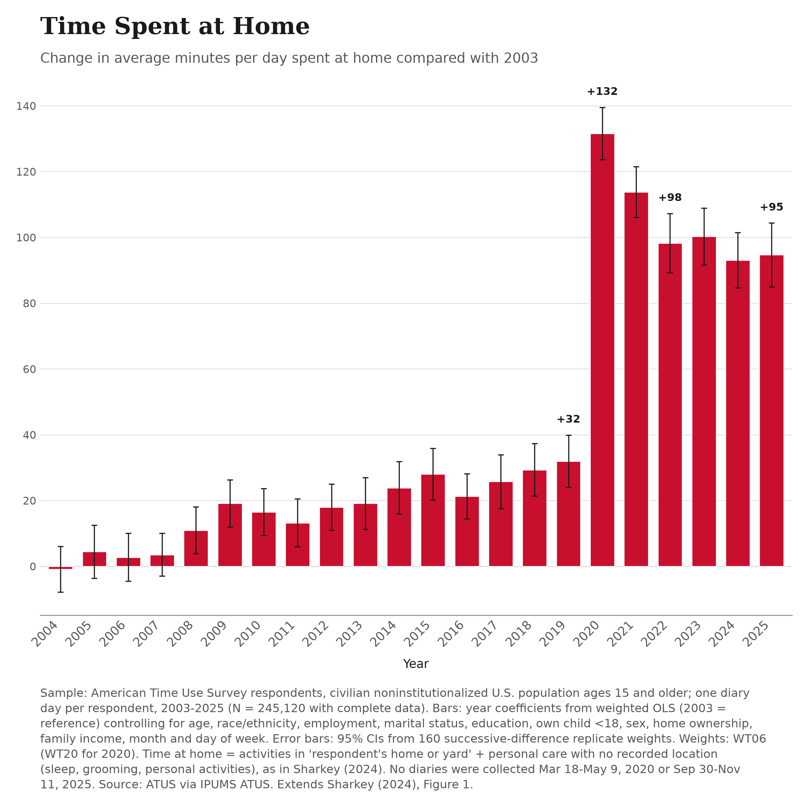

# Time at home and job work in the American Time Use Survey, 2003–2025

Replication package for three charts that extend Patrick Sharkey's (2024) "Homebound" Figure 1 through
2025 and separate the rise in time at home from job work done at home:

1. **Time Spent at Home**: demographic-adjusted change in minutes per day at home vs. 2003.
2. **Time at Home, Excluding Job Work**: the same, after subtracting job-work minutes done at home.
3. **Time at Home, Adjusted for Work Patterns**: total time at home, additionally holding diary-day
   job-work time and location constant.

| Minutes per day vs. 2003 | 2019 | 2022 | 2025 |
|---|---|---|---|
| Chart 1: total time at home | +32.0 | +98.3 | +94.7 |
| Job work done at home | +4.3 | +28.9 | +25.2 |
| Chart 2: excluding job work at home | +27.7 | +69.3 | +69.5 |
| Chart 3: adjusted for diary-day work patterns | +25.1 | +60.7 | +59.3 |

The code matches Sharkey's reported replication benchmarks to their stated precision: the 2003 and 2022
weighted means in his replication log (991.9541 and 1,091.323 minutes; reproduced as 991.9541 and
1,091.3233), his 2003–2022 analytic N (222,757), and the published 2022 coefficient (≈ +99; +98.90 here). See
[`docs/methods.md`](docs/methods.md) for definitions, the model, survey-design choices, all sensitivity
checks and caveats.



## Data

**No IPUMS microdata are included**, per the IPUMS terms of use. To reproduce the results, create a free IPUMS
ATUS extract following [`docs/ipums_extract.md`](docs/ipums_extract.md) and place the `.dat.gz` file and its
DDI `.xml` codebook in `data/`.

## Running

Tested with Python 3.12.10; `requirements.txt` pins the exact package versions used to produce `results/`.

```
pip install -r requirements.txt
python run_all.py                  # main results (Sharkey home definition) -> results/
python run_all.py --home-def sleep # optional: narrower home definition -> results_home_sleep_only/
```

A full run takes a few minutes: it parses the ~1.5 GB extract once (cached in `build/`), then refits each
main model with 160 replicate weights. The run log is written to `build/`.

## Repository layout

| Path | Contents |
|---|---|
| `run_all.py` | Pipeline: checks, Sharkey reproduction, Charts 1–3, all sensitivity checks, figures |
| `homebound/data.py` | Reads the hierarchical extract via its DDI codebook; builds one record per respondent from activity records |
| `homebound/controls.py` | Demographic and calendar controls, recoded from IPUMS value labels; weights |
| `homebound/models.py` | Design matrices, weighted least squares, HC1 and replicate-weight (SDR) variances, spline terms |
| `homebound/charts.py` | 2500 × 2500 px charts |
| `docs/ipums_extract.md` | Exact IPUMS ATUS extract specification and download steps |
| `docs/methods.md` | Methods, results, sensitivity checks, caveats, references |
| `results/` | Output generated by `run_all.py` (aggregate estimates only) |

## Results files

| File | Contents |
|---|---|
| `chart{1,2,3}_*.png / .pdf` | The three charts |
| `annual_results_main.csv` | Year contrasts, SDR and HC1 standard errors, 95% CIs and unweighted N for Charts 1–3, the job-work accounting series (WH, W) and the linear Chart 3 diagnostic |
| `sensitivity_main.csv` | Narrower home definition, broad work definition, excluding 2020, restricted period, complete work-location sample, subgroups, HC1 intervals |
| `sensitivity_chart3_travel_splines.csv` (+ `_fit.csv`) | Chart 3 with work-travel controls and natural cubic splines |
| `sensitivity_chart3_interactions.csv` | Year × work-pattern interaction model, standardized to the 2003 and 2019 work-pattern mixes |
| `annual_diagnostics.csv` | Weighted annual means (time at home, job work by location, work travel, unknown activities), work-pattern shares, diary-date coverage |
| `validation_checks.csv` | Construction checks and the Sharkey (2024) reproduction benchmarks |
| `sample_flow.csv`, `environment.txt` | Sample construction; software versions |

## References

- Sharkey, Patrick. 2024. "Homebound: The Long-Term Rise in Time Spent at Home Among U.S. Adults."
  *Sociological Science* 11: 553–578. <https://doi.org/10.15195/v11.a20>
- Sarah M. Flood, Liana C. Sayer, Daniel Backman and Etienne Breton. American Time Use Survey Data Extract
  Builder: Version 3.4 [dataset]. College Park, MD: University of Maryland and Minneapolis, MN: IPUMS, 2026.
  DOI 10.18128/D060.V3.4 (<https://www.ipums.org/projects/ipums-time-use/d060.V3.4>)

## License

The contents of this repository (code, documentation and aggregate results) are dedicated to the public
domain under [CC0 1.0 Universal](LICENSE). IPUMS ATUS microdata are not included and remain subject to the
IPUMS terms of use.
